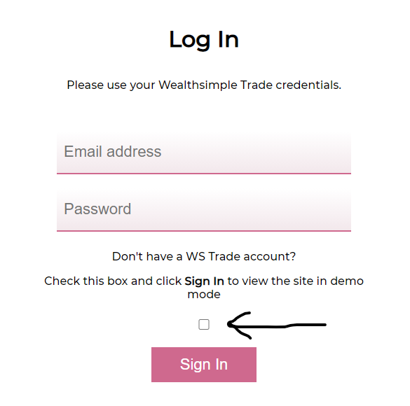
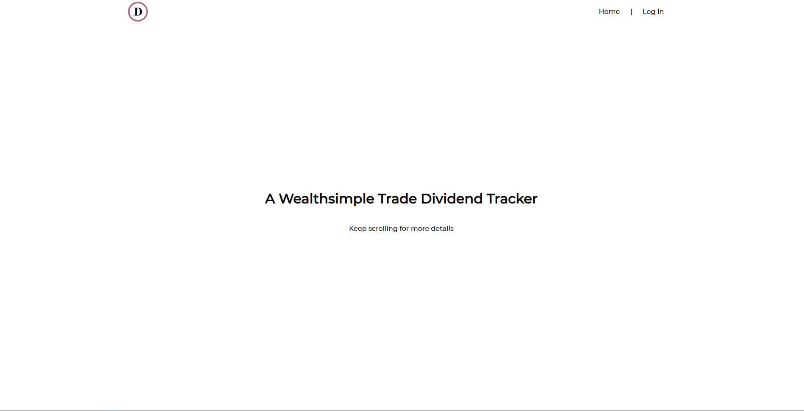
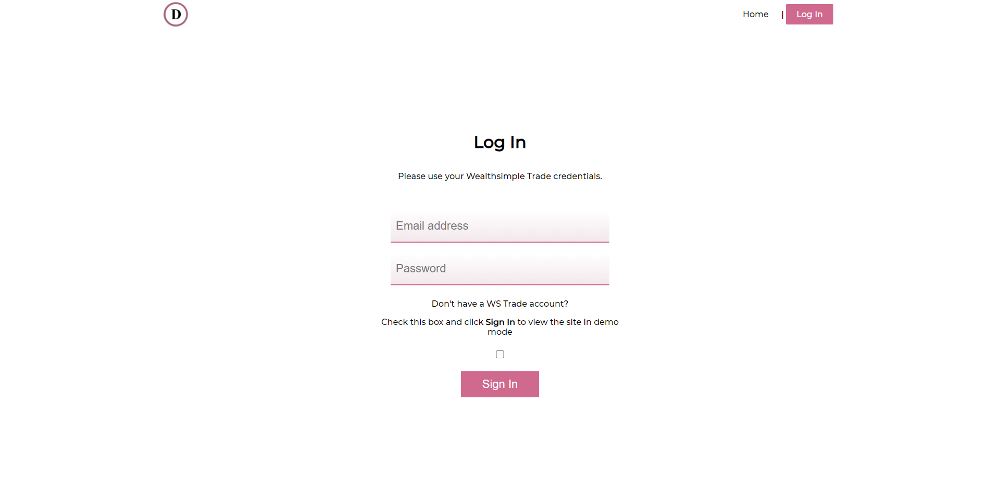

### For Shopify People
If you want to login to the website without a Wealthsimple Trade account go to the website (rafusel.github.io/dividend-tracker-ui). In the nav bar click **Log In**, and then select the checkbox for demo mode (indicated in the screenshot below) and click **Sign In**.

### Description

This project was created to easily track my dividend income from my holdings on Wealthsimple Trade. I discovered some [unofficial API docs](https://github.com/MarkGalloway/wealthsimple-trade/blob/master/API.md) and decided to create a simple service that could allow a Wealthsimple Trade user to log in with their credentials and have dividend analytics available to them. 

Primarily, this was created so that I could have the metrics available to me that matter the most to me, however if you want to add something feel free to open PR or an issue for any metrics that you'd like to see implemented.

### Front end
The front end of this app is a single page React application hosted [here](https://rafusel.github.io/dividend-tracker-ui/). Some other tools to note that are used alongside react is:
- Redux for state management
- Axios for HTTP requests to the back end
- React Router DOM for in-app routing

### Back end
The Wealthsimple Trade API does not allow client-side requests due to the CORS policy. Therefore this app requires a back end to make requests for the front end. The back end is a minimal NodeJS server hosted [here](https://wealthsimple-trade-dividends.herokuapp.com/). The front end React app hits API endpoints on this server which in turn makes a request to Wealthsimple, crunches some of the data into a more useful form for the app, and passes on the modified data back to the client. 

### The homepage

### The login page

This project was bootstrapped with [Create React App](https://github.com/facebook/create-react-app).
